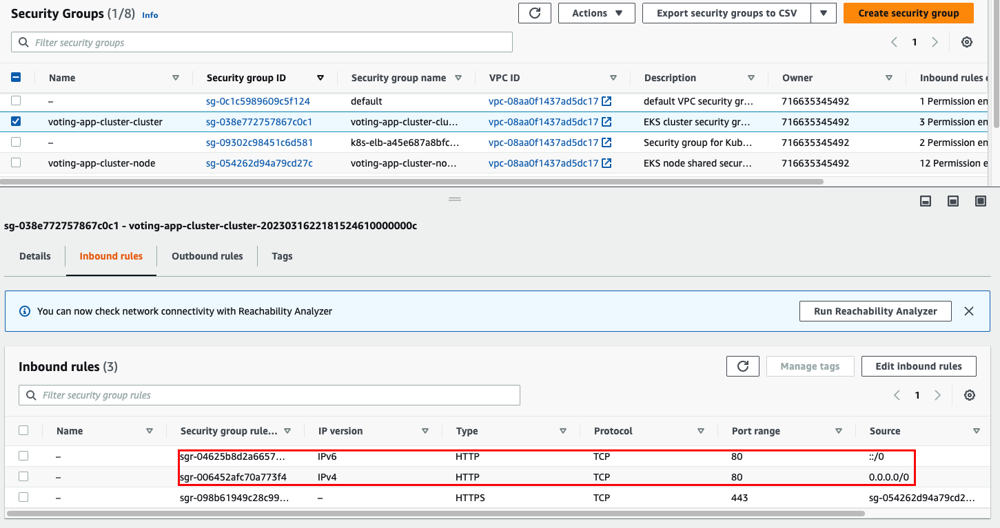
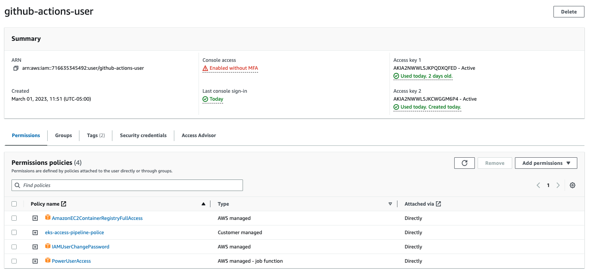

# Voting App

A simple distributed application running across multiple Docker containers.
The purpose of this app is to know what is the most preferred way to learn by: Listening or Practising.


## Architecture


* A front-end web app in [Python](/vote) which lets you vote between two options
* A [Redis](https://hub.docker.com/_/redis/) which collects new votes
* A [.NET](/worker/) worker which consumes votes and stores them in…
* A [Postgres](https://hub.docker.com/_/postgres/) database backed by a Docker volume
* A [Node.js](/result) web app which shows the results of the voting in real time

## Challenge
The goal of the challenge is to deploy this distributed application into AWS cloud provider, using:
- Use [Terraform](https://developer.hashicorp.com/terraform/tutorials/aws-get-started) for create the AWS infrastructure.
- Use [EC2](https://docs.aws.amazon.com/AWSEC2/latest/UserGuide/concepts.html) for create the virtual server.
- Use [EKS](https://docs.aws.amazon.com/whitepapers/latest/overview-deployment-options/amazon-elastic-kubernetes-service.html) for orchestration.
- Use [ECR](https://docs.aws.amazon.com/AmazonECR/latest/userguide/what-is-ecr.html) to save docker images.
- Use [AWS Secrets Manager](https://docs.aws.amazon.com/secretsmanager/latest/userguide/intro.html).
- Use Github Action or Circle CI for triggers a pipeline.

## AWS Architecture solution

This solution is created in `N. Virginia` region (`us-east-1`):

- EC2 as virtual server machine in the AWS cloud.
- ECR as docker images repository.
- EKS for orchestration docker images.
- Security groups that have all permission in AWS about network configuration: VPC, inbound rules, outbound rules.
- [Load balancer](https://aws.amazon.com/what-is/load-balancing/) for exposing the application to internet.


## Implement solution
## Run locally with K8 and Minikube.
1. Cloning this repository in local machine: https://github.com/ivanthoughtworks/aws-voting-app.
2. Install [minikube](https://minikube.sigs.k8s.io/docs/start/).
3. Start cluster with minikube: `minikube start`
4. To access to a new cluster `minikube kubectl -- get po -A`
5. Use this command if you don't have minikube installed `kubectl get po -A`
6. Use alias to use minikube with kubectl `alias kubectl="minikube kubectl --"`
7. To run a service to see all cluster `minikube dashboard`.
8. In the project root, run `kubectl create -f k8s-specifications-local`. Note it will create these resources in your current namespace (`default` if you haven't changed it).
9. The vote web app is then available on port `31000` on each host of the cluster, the result web app is available on port `31001`.
10. To remove them, run: `kubectl delete -f k8s-specifications-local/`

## Run locally with Docker compose

Another option is run the application with docker compose.

Run the following command to create the deployments and services. Note it will create these resources in your current namespace (`default` if you haven't changed it.)

```shell
docker compose up
```

Vote app is running up in http://localhost:5000 and the result app running in http://localhost:5001

To remove them, run:

```shell
docker compose down
```

## Build docker images and upload to ECR
1. Build docker image. Note: REMEMBER THE `.` at the end
```shell
docker build -t <name-tag> .
```

2. Create repository in ECR with `aws cli`.
```shell
aws ecr create-repository --repository-name <repo_name> --region <region_name>
```

Example:

```shell
aws ecr create-repository --repository-name voting-app --region us-east-1
```

3. Get encrypted token.
```shell
aws ecr get-login-password --region <region_name>
```

Example:
```shell
aws ecr --region us-east-1 | docker login -u AWS -p <token> 71663534xxxx.dkr.ecr.us-east-1.amazonaws.com/voting-app
```

4. Login to our AWS private ECR.
```shell
aws ecr --region <region> | docker login -u AWS -p <encrypted_token> <repo_uri>
```
Example:
```shell
aws ecr --region <region> | docker login -u AWS -p <encrypted_token> 71663534xxxx.dkr.ecr.us-east-1.amazonaws.com/voting-app
```

5. Tag a local docker image.
```shell
docker tag <source_image_tag> <target_ecr_repo_uri>
```
Example:
```shell
docker tag voting-app:latest 71663534xxxx.dkr.ecr.us-east-1.amazonaws.com/voting-app:latest
```

6. Push docker image to ECR.
```shell
docker push <ecr-repo-uri>
````
Example
```shell
docker push 71663534xxxx.dkr.ecr.us-east-1.amazonaws.com/voting-app
````
## Create EKS
1. Download and install eksctl: [Official CLI tool](https://github.com/weaveworks/eksctl) for `AWS EKS`.
2. Create VPC with this template using [AWS CloudFormation](https://aws.amazon.com/cloudformation/): https://amazon-eks.s3.us-west-2.amazonaws.com/cloudformation/2020-06-10/amazon-eks-vpc-private-subnets.yaml
3. Create cluster with config file:
```yaml
apiVersion: eksctl.io/v1alpha5
kind: ClusterConfig
metadata:
  name: voting-app-cluster
  region: us-east-1

vpc:
  id: <vpc-id-created-in-step2> # i.e: vpc-09ee0ce943b8cxxxx
  cidr: "192.168.0.0/16"
  subnets:
    public:
      us-east-1:
        id: <subnet-public-id-created-in-step2> # i.e: subnet-0425758101110xxxx
      us-east-1a:
        id: <subnet-public-id-created-in-step2> # i.e: subnet-0684eb5ade025xxxx
    private:
      us-east-1:
        id: <subnet-private-id-created-in-step2> # i.e: subnet-083e6c24a30aexxxx
      us-east-1b:
        id: <subnet-private-id-created-in-step2> # i.e: subnet-083e6c24a30aexxxx

nodeGroups:
  - name: voting-app-node-1
    instanceType: t3.small
    desiredCapacity: 2
  - name: voting-app-node-2
    instanceType: t3.small
    desiredCapacity: 1
    privateNetworking: true
````

4. Create EKS with eks cli.
```shell
eksctl create cluster -f cluster.yaml --kubeconfig=~/.kube/config
```
5. Use local command line console with EKS cluster.
```shell
aws eks --region <region> update-kubeconfig --name <name of cluster EKS>
```
6. Confirm that it is all good.
```shell
kubectl get svc
```
7. Go to your container config folder, where you have k8 configs like `service.yaml` and `deployment.yaml`.

8. Apply deployment and service yaml configuration.
```shell
kubectl apply -f deployment.yaml
kubectl get deployments
```
Example
```shell
kubectl apply -f vote-deployment.yaml
kubectl apply -f vote-service.yaml
kubectl apply -f db-deployment.yaml
kubectl apply -f db-service.yaml
kubectl apply -f redis-deployment.yaml
kubectl apply -f redis-service.yaml
kubectl apply -f result-deployment.yaml
kubectl apply -f result-service.yaml
kubectl apply -f worker-deployment.yaml
```

```shell
kubectl get deployments
```
Output
```shell
NAME     READY   UP-TO-DATE   AVAILABLE   AGE
db       1/1     1            1           54m
redis    1/1     1            1           96m
result   1/1     1            1           35m
vote     1/1     1            1           3h23m
worker   1/1     1            1           36m
```

9. Check pods were created
```shell
kubectl get pods -o wide
```
Output
```shell
NAME                      READY   STATUS    RESTARTS   AGE     IP           NODE                   NOMINATED NODE   READINESS GATES
db-8845b68b7-wm8qf        1/1     Running   0          56m     10.0.x.x   ip-10-0-x-x.ec2.internal   <none>           <none>
redis-549d6f9fc6-pp6jc    1/1     Running   0          98m     10.0.x.x   ip-10-0-x-x.ec2.internal   <none>           <none>
result-78476b5b8c-cbxws   1/1     Running   0          37m     10.0.x.x   ip-10-0-x-x.ec2.internal   <none>           <none>
vote-996fb97fd-md6zf      1/1     Running   0          3h25m   10.0.x.x   ip-10-0-x-x.ec2.internal   <none>           <none>
worker-f54cd56ff-rls2f    1/1     Running   0          38m     10.0.x.x   ip-10-0-x-x.ec2.internal   <none>           <none>
```
10. Check nodes were created
```shell
kubectl get nodes -o wide
```
Output
```shell
NAME                         STATUS   ROLES    AGE    VERSION            INTERNAL-IP EXTERNAL-IP     OS-IMAGE         KERNEL-VERSION             CONTAINER-RUNTIME
ip-10-0-x-x.ec2.internal   Ready    <none>   5d7h   v1.24.10-eks-48e63af   10.0.x.x    <none>        Amazon Linux 2   5.x.x-x.x.amzn2.x86_64   containerd://1.6.6
ip-10-0-x-x.ec2.internal   Ready    <none>   5d7h   v1.24.10-eks-48e63af   10.0.x.x    <none>        Amazon Linux 2   5.x.x-x.x.amzn2.x86_64   containerd://1.6.6
```

11. To see logs of each deployment:
```shell
kubectl --namespace=default logs -f -l "app=db"
```

12. For removing a deployment or service:

```shell
kubectl delete deployment [deployment-name]
kubectl delete service [service-name]
```
Example:
```shell
kubectl delete deployment vote
kubectl delete service vote
```

## Create Load Balancer
1. Ensure to select the previous `eks` cluster
```shell
aws eks --region us-east-1 update-kubeconfig --name voting-app-cluster
```
2. Enter to `k8s-specifications` folder.
```shell
kubectl create -f vote-loadbalancer.yaml
kubectl create -f result-loadbalancer.yaml
```
3. Expose a deployment of LoadBalancer type:
```shell
kubectl expose deployment [deployment-name] --type=LoadBalancer  --name=vote-loadbalancer
```
Example
```shell
kubectl expose deployment vote --type=LoadBalancer  --name=vote-loadbalancer
kubectl expose deployment result --type=LoadBalancer  --name=result-loadbalancer
```
4. Get information about `service`:
```shell
kubectl get service/vote-loadbalancer |  awk {'print $1" " $2 " " $4 " " $5'} | column -t
kubectl get service/result-loadbalancer |  awk {'print $1" " $2 " " $4 " " $5'} | column -t
```
The output will return an external ip
```shell
NAME                     TYPE          EXTERNAL-IP                                                              PORT(S)
vote-loadbalancer    LoadBalancer  *****.us-east-1.elb.amazonaws.com  80:31981/TCP
result-loadbalancer  LoadBalancer  *****.us-east-1.elb.amazonaws.com  80:31981/TCP
```
5. Verify that you can access the load balancer externally using the external ip from previous step:
```shell
curl -silent *****.us-east-1.elb.amazonaws.com | grep title
```
**NOTE:** If curl works but in the browser the url doesn't work, please ensure that port `80` is enable for cluster and node in the `Inbound Rules` option from `Security Groups` in `EC2`.



## Use AWS Secrets Manager
1. Install helm cli: https://helm.sh/docs/intro/install/
2. Install eksctl: https://github.com/weaveworks/eksctl
3. Install `cis-driver` in the cluster
```shell
helm repo add secrets-store-csi-driver https://kubernetes-sigs.github.io/secrets-store-csi-driver/charts

helm install -n kube-system csi-secrets-store secrets-store-csi-driver/secrets-store-csi-driver --set syncSecret.enabled=true

kubectl apply -f https://raw.githubusercontent.com/aws/secrets-store-csi-driver-provider-aws/main/deployment/aws-provider-installer.yaml
```

4. Create the secret
```shell
aws --region "$REGION" secretsmanager create-secret --name MySecret --secret-string "MySecretValue"
```
5. Define the policy
```shell
POLICY_ARN=$(aws --region "$REGION" --query Policy.Arn --output text iam create-policy --policy-name my-deployment-policy --policy-document '{
    "Version": "2012-10-17",
    "Statement": [ {
        "Effect": "Allow",
        "Action": ["secretsmanager:GetSecretValue", "secretsmanager:DescribeSecret"],
        "Resource": ["arn:*:secretsmanager:*:*:secret: MySecret-??????"]
    }]
}')
```
6. Install `oidc-provider` in the cluster
```shell
eksctl utils associate-iam-oidc-provider --region="$REGION" --cluster="$CLUSTERNAME" --approve
```
7. Attach the policy with the service account
```shell
eksctl create iamserviceaccount --name my-deployment-sa --region="$REGION" --cluster "$CLUSTERNAME" --attach-policy-arn "$POLICY_ARN" --approve --override-existing-serviceaccounts
```
More documentation: https://github.com/aws/secrets-store-csi-driver-provider-aws
https://secrets-store-csi-driver.sigs.k8s.io/topics/set-as-env-var.html

## Use Terraform to automate creation of EKS and VPC
The folder `terraform` contains the files: `main.tf`, `outputs.tf`, `terraform.tf`.
They have the configuration for creating of `EKS` and `VPC` in an automated way from previous steps.

1. In the folder `terraform` execute the next command.

```shell
terraform init
```

2. For validating if the terraform configuration is correct:

```shell
terraform plan
```

3. Apply changes to aws

```shell
terraform apply
```

4. To delete all configurations:

```shell
terraform destroy
```

## Github Actions
- In order to use Github Actions, it is needed to create a user in aws with permissions policies for EKS, EC2.

- Add user's security credentials into secrets variables in Github.
- Actions are automatizing the building of docker images and push them to ECR repositories.