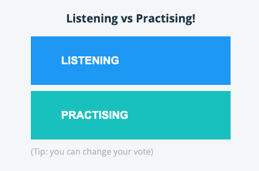
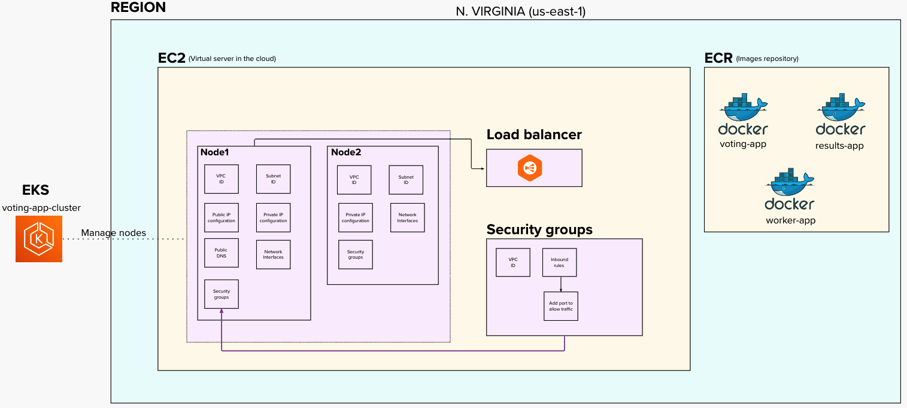

# Voting App

A simple distributed application running across multiple Docker containers.
The purpose of this app is to know what is the most preferred way to learn by: Listening or Practising.



## Architecture


* A front-end web app in [Python](/vote) which lets you vote between two options
* A [Redis](https://hub.docker.com/_/redis/) which collects new votes
* A [.NET](/worker/) worker which consumes votes and stores them in…
* A [Postgres](https://hub.docker.com/_/postgres/) database backed by a Docker volume
* A [Node.js](/result) web app which shows the results of the voting in real time

## Challenge

- Use [Terraform](https://developer.hashicorp.com/terraform/tutorials/aws-get-started) for create the AWS infrastructure.
- Use [EC2](https://docs.aws.amazon.com/AWSEC2/latest/UserGuide/concepts.html) for create the virtual server.
- Use [EKS](https://docs.aws.amazon.com/whitepapers/latest/overview-deployment-options/amazon-elastic-kubernetes-service.html) for orchestration docker images.
- Use [ECR](https://docs.aws.amazon.com/AmazonECR/latest/userguide/what-is-ecr.html) to save docker images.
- Use [AWS Secrets Manager](https://docs.aws.amazon.com/secretsmanager/latest/userguide/intro.html).
- Use Github Action or Circle CI for triggers a pipeline.

## AWS Architecture solution

This solution is created in `N. Virginia` region (`us-east-1`):

- EC2 as virtual server machine in the AWS cloud.
- ECR as docker images repository.
- EKS for orchestration docker images.
- Security groups that have all permission in AWS about network configuration: VPC, inbound rules, outbound rules.
- [Load balancer](https://aws.amazon.com/what-is/load-balancing/) for exposing the application to internet.




## Implement solution
## Run locally docker images
1. Cloning this repository in local machine: https://github.com/ivanthoughtworks/aws-voting-app.
2. Install [minikube](https://minikube.sigs.k8s.io/docs/start/).
3. Start cluster with minikube: `minikube start`
4. To access to a new cluster`kubectl get po -A`
5. Use this command if you don't have minikube installed`minikube kubectl -- get po -A`
6. Use alias to use minikube with kubectl `alias kubectl="minikube kubectl --"`
7. To run a service to see all cluster `minikube dashboard`. Attached image: minikube-dashboard.png
8. In the project root, run `kubectl create -f k8s-specifications/` to create 
kubernetes according the configuration inside k8s-specifications folder.
9. The ui is running up in http://localhost:5000 and the insights app running in http://localhost:5001


## Run the app in Kubernetes

The folder `k8s-specifications` contains the YAML specifications of the Voting App's services.

Run the following command to create the deployments and services. Note it will create these resources in your current namespace (`default` if you haven't changed it.)

```shell
kubectl create -f k8s-specifications/
```

The `vote` web app is then available on port 31000 on each host of the cluster, the `result` web app is available on port `31001`.

To remove them, run:

```shell
kubectl delete -f k8s-specifications/
```

## Build docker images and upload to ECR
1. Build docker image. Note: REMEMBER THE `.` at the end
```shell
docker build -t <name-tag> .
```

2. Create repository in ECR with `aws cli`.
```shell
aws ecr create-repository --repository-name <repo_name> --region <region_name>
```

Example:

```shell
aws ecr create-repository --repository-name voting-app --region us-east-1
```

3. Get encrypted token.
```shell
aws ecr get-login-password --region <region_name>
```

Example:
```shell
aws ecr --region us-east-1 | docker login -u AWS -p <token> 716635345492.dkr.ecr.us-east-1.amazonaws.com/voting-app
```

4. Login to our AWS private ECR.
```shell
aws ecr --region <region> | docker login -u AWS -p <encrypted_token> <repo_uri>
```
Example:
```shell
aws ecr --region <region> | docker login -u AWS -p <encrypted_token> 716635345492.dkr.ecr.us-east-1.amazonaws.com/voting-app
```

5. Tag a local docker image.
```shell
docker tag <source_image_tag> <target_ecr_repo_uri>
```
Example:
```shell
docker tag voting-app:latest 716635345492.dkr.ecr.us-east-1.amazonaws.com/voting-app:latest
```

6. Push docker image to ECR.
```shell
docker push <ecr-repo-uri>
````
Example
```shell
docker push 716635345492.dkr.ecr.us-east-1.amazonaws.com/voting-app
````
## Create EKS
1. Download and install eksctl — Official [CLI tool](https://github.com/weaveworks/eksctl) for AWS EKS.
2. Create VPC with this template: https://amazon-eks.s3.us-west-2.amazonaws.com/cloudformation/2020-06-10/amazon-eks-vpc-private-subnets.yaml
3. Create cluster with config file:
```yaml
apiVersion: eksctl.io/v1alpha5
kind: ClusterConfig
metadata:
  name: voting-app-cluster
  region: us-east-1

vpc:
  id: vpc-09ee0ce943b8c8d63
  cidr: "192.168.0.0/16"
  subnets:
    public:
      us-east-1:
        id: subnet-04257581011106487
      us-east-1:
        id: subnet-0684eb5ade0256973
    private:
      us-east-1:
        id: subnet-083e6c24a30ae4ed2
      us-east-1:
        id: subnet-083e6c24a30ae4ed2

nodeGroups:
  - name: voting-app-workers
    instanceType: t2.medium
    desiredCapacity: 2
  - name: voting-app-workers
    instanceType: t2.medium
    desiredCapacity: 1
    privateNetworking: true
````

4. Create EKS with eks cli.
```shell
eksctl create cluster -f cluster.yaml --kubeconfig=~/.kube/config
```
5. Confirm that it is all good.
```shell
kubectl get svc
```
6. Write these configuration details to config file issue following command.
```shell
aws eks --region <region> update-kubeconfig --name <name of cluster EKS>
```
7. Go to your container config folder, where you have k8 configs like `service.yaml` and `deployment.yaml`.

8. Apply deployment and service yaml configuration.
```shell
kubectl apply -f deployment.yaml
kubectl get deployments
```
Example
```shell
kubectl apply -f vote-deployment.yaml
kubectl apply -f vote-service.yaml
kubectl apply -f db-deployment.yaml
kubectl apply -f db-service.yaml
kubectl apply -f redis-deployment.yaml
kubectl apply -f redis-service.yaml
kubectl apply -f result-deployment.yaml
kubectl apply -f result-service.yaml
kubectl apply -f worker-deployment.yaml
```

```shell
kubectl get deployments
```
Output
```shell
NAME     READY   UP-TO-DATE   AVAILABLE   AGE
db       1/1     1            1           54m
redis    1/1     1            1           96m
result   1/1     1            1           35m
vote     1/1     1            1           3h23m
worker   1/1     1            1           36m
```

9. Check pods were created
```shell
kubectl get pods -o wide
```
Output
```shell
NAME                      READY   STATUS    RESTARTS   AGE     IP           NODE                   NOMINATED NODE   READINESS GATES
db-8845b68b7-wm8qf        1/1     Running   0          56m     10.0.x.x   ip-10-0-x-x.ec2.internal   <none>           <none>
redis-549d6f9fc6-pp6jc    1/1     Running   0          98m     10.0.x.x   ip-10-0-x-x.ec2.internal   <none>           <none>
result-78476b5b8c-cbxws   1/1     Running   0          37m     10.0.x.x   ip-10-0-x-x.ec2.internal   <none>           <none>
vote-996fb97fd-md6zf      1/1     Running   0          3h25m   10.0.x.x   ip-10-0-x-x.ec2.internal   <none>           <none>
worker-f54cd56ff-rls2f    1/1     Running   0          38m     10.0.x.x   ip-10-0-x-x.ec2.internal   <none>           <none>
```
10. Check nodes were created
```shell
kubectl get nodes -o wide
```
Output
```shell
NAME                         STATUS   ROLES    AGE    VERSION            INTERNAL-IP EXTERNAL-IP     OS-IMAGE         KERNEL-VERSION             CONTAINER-RUNTIME
ip-10-0-x-x.ec2.internal   Ready    <none>   5d7h   v1.24.10-eks-48e63af   10.0.x.x    <none>        Amazon Linux 2   5.x.x-x.x.amzn2.x86_64   containerd://1.6.6
ip-10-0-x-x.ec2.internal   Ready    <none>   5d7h   v1.24.10-eks-48e63af   10.0.x.x    <none>        Amazon Linux 2   5.x.x-x.x.amzn2.x86_64   containerd://1.6.6
```
11. Check security goups, inside EC2 search the instance that contains the nodes, under Security groups then add the inbound rules, so your ports are accesible from outside(example `8080` for web apps)

12. Ready, you could use the public IP and the ports to check that your trafic is working

13. To see logs of each deployment:
```shell
kubectl --namespace=default logs -f -l "app=db"
```

## Create Load Balancer
1. Ensure to select the previous `eks` cluster
```shell
aws eks --region us-east-1 update-kubeconfig --name voting-app-cluster
```
2. Enter to `k8s-specifications` folder.
```shell
kubectl create -f vote-loadbalancer.yaml
kubectl create -f result-loadbalancer.yaml
```
3. Expose a deployment of LoadBalancer type:
```shell
kubectl expose deployment [deployment-name] --type=LoadBalancer  --name=voting-app-loadbalancer
```
Example
```shell
kubectl expose deployment vote --type=LoadBalancer  --name=voting-app-loadbalancer
kubectl expose deployment result --type=LoadBalancer  --name=voting-app-loadbalancer
```
4. Get information about `service`:
```shell
kubectl get service/vote-app-loadbalancer |  awk {'print $1" " $2 " " $4 " " $5'} | column -t
kubectl get service/result-app-loadbalancer |  awk {'print $1" " $2 " " $4 " " $5'} | column -t
```
The output will return an external ip
```shell
NAME                     TYPE          EXTERNAL-IP                                                              PORT(S)
vote-app-loadbalancer  LoadBalancer  *****.us-east-1.elb.amazonaws.com  80:31981/TCP
result-app-loadbalancer  LoadBalancer  *****.us-east-1.elb.amazonaws.com  80:31981/TCP
```
5. Verify that you can access the load balancer externally using the external ip from previous step:
```shell
curl -silent *****.us-east-1.elb.amazonaws.com | grep title
```


## Use AWS Secrets Manager
1. Install helm cli: https://helm.sh/docs/intro/install/
2. Install eksctl: https://github.com/weaveworks/eksctl
3. Install `cis-driver` in the cluster
```shell
helm repo add secrets-store-csi-driver https://kubernetes-sigs.github.io/secrets-store-csi-driver/charts

helm install -n kube-system csi-secrets-store secrets-store-csi-driver/secrets-store-csi-driver --set syncSecret.enabled=true

kubectl apply -f https://raw.githubusercontent.com/aws/secrets-store-csi-driver-provider-aws/main/deployment/aws-provider-installer.yaml
```

4. Create the secret
```shell
aws --region "$REGION" secretsmanager create-secret --name MySecret --secret-string "MySecretValue"
```
5. Define the policy
```shell
POLICY_ARN=$(aws --region "$REGION" --query Policy.Arn --output text iam create-policy --policy-name my-deployment-policy --policy-document '{
    "Version": "2012-10-17",
    "Statement": [ {
        "Effect": "Allow",
        "Action": ["secretsmanager:GetSecretValue", "secretsmanager:DescribeSecret"],
        "Resource": ["arn:*:secretsmanager:*:*:secret: MySecret-??????"]
    }]
}')
```
6. Install `oidc-provider` in the cluster
```shell
eksctl utils associate-iam-oidc-provider --region="$REGION" --cluster="$CLUSTERNAME" --approve
```
7. Attach the policy with the service account
```shell
eksctl create iamserviceaccount --name my-deployment-sa --region="$REGION" --cluster "$CLUSTERNAME" --attach-policy-arn "$POLICY_ARN" --approve --override-existing-serviceaccounts
```
More documentation: https://github.com/aws/secrets-store-csi-driver-provider-aws
https://secrets-store-csi-driver.sigs.k8s.io/topics/set-as-env-var.html